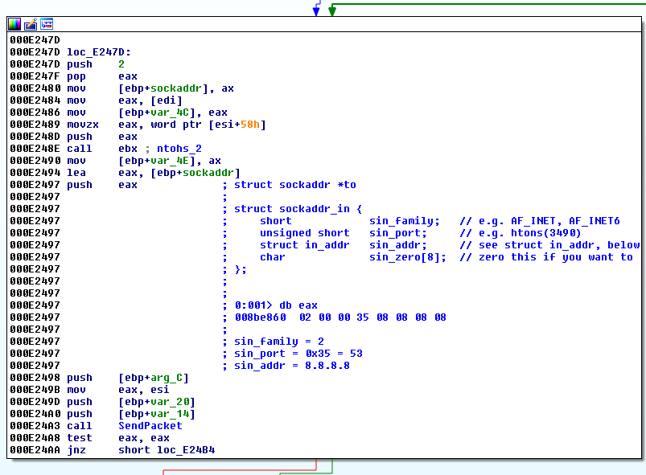
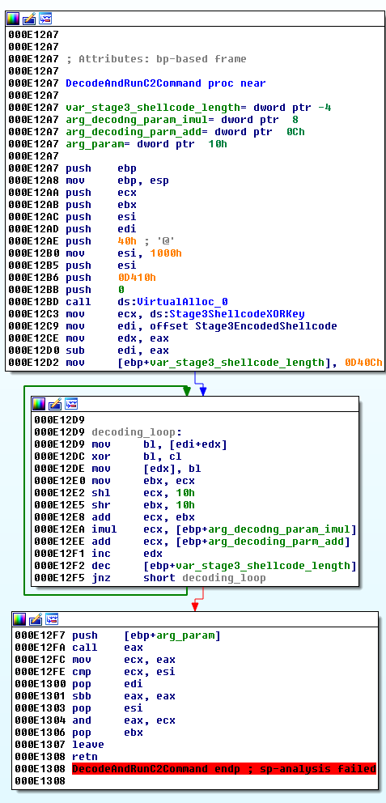

# Background
These are dumped files from NetSarang XShell backdoor. The target analysis file's sha1 is 462a02a8094e833fd456baf0a6d4e18bb7dab1a9f74d5f163a8334921a4ffde8.

The function at 1000c6c0 is the maliciously injected code from the infiltrator.

The [Decode.py](Decode.py) is the python code to extract [Stage 1 shellcode](Stage1.bin). The [Stage1.idb](Stage1.idb) contains the IDA analysis file with some comments. The Stage1 is a mere loader of the Stage2, so it is not the focus of this analysis.

The call instruction at dfb10 will lead to decoded [Stage 2 shellcode](Stage2.bin). The [Stage2.idb](Stage2.idb) file contains the IDA file.

```
seg000:000DFB10             call_stage2_shellcode:                  ; call stage2 shellcode
seg000:000DFB10 FF D7                       call    edi
```

Stage2 shellcode uses CreateThread to create new thread from ThreadStart function. This function has the main C2 connection loop. It uses UDP communication which is initialized at InitUDPSocket function. The important function names and IP are encoded using shift/XOR type encoding scheme which is also used for stage1 shellcode encoding. The main functions of the stage 2 shellcode is typical backdoor.

The C2 communication routine looks like following which uses 8.8.8.8:53 or other popular public DNS servers as it's DNS tunneling initial name server. Eventually, the DNS response will come from the fake DNS server under attacker's control and the packets will contain key data that will be used for C2 actions.



As you can see from the following screenshot, the parameter used for decoding next stage shellcode and C2 operation is encoded with the values that should come from fake DNS server.



# Credits
TI-Secret-Channel
